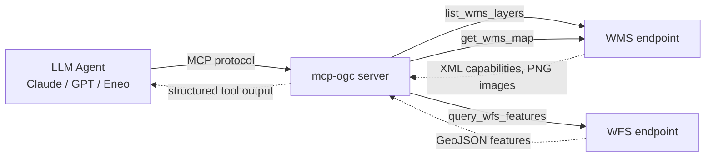

# mcp-ogc

[](https://github.com/nickoulos/mcp-ogc/actions/workflows/ci.yml)
[](LICENSE)
[](https://www.python.org/)

Expose OGC **WMS** and **WFS** geospatial services as [Model Context Protocol](https://modelcontextprotocol.io)
tools, so LLM agents can discover layers, render maps, and query vector features from any
standards-compliant geodata server.

## What it does

`mcp-ogc` runs as an MCP server that any MCP-compatible client (Claude Desktop, custom agents,
Eneo assistants) can attach to. It exposes three tools:

- **`list_wms_layers(wms_url)`** — discover what layers a WMS endpoint exposes (name, title,
  abstract, supported CRS, bounding box).
- **`get_wms_map(wms_url, layer, bbox, ...)`** — fetch a rendered map image for a bounding box.
- **`query_wfs_features(wfs_url, type_name, bbox, ...)`** — query vector features as GeoJSON.

This means an agent can ask *"what layers does this municipal map server have, and what's at this
location?"* against any INSPIRE-compliant GIS service — without per-service custom integration.

## Why

Municipal and national GIS data is overwhelmingly published via OGC standards (WMS, WFS). LLM
agents speak REST and JSON. `mcp-ogc` bridges them in a few hundred lines of Python so geospatial
reasoning becomes available to any LLM workflow.

Built by [Foursight Lab](https://foursightlab.com).

## Architecture



## Quick start

Requires Python 3.12+ and [uv](https://docs.astral.sh/uv/).

```bash
git clone https://github.com/nickoulos/mcp-ogc
cd mcp-ogc
uv sync
uv run mcp-ogc
```

To attach to Claude Desktop, add this to your `claude_desktop_config.json`
(see [`examples/claude_desktop.json`](examples/claude_desktop.json)):

```json
{
  "mcpServers": {
    "ogc": {
      "command": "mcp-ogc"
    }
  }
}
```

See [`examples/demo.ipynb`](examples/demo.ipynb) for a full walkthrough of the three tools against
a live public WMS/WFS.

## Development

```bash
uv sync            # install deps (incl. dev tools)
uv run pytest -q   # run the hermetic test suite (no network)
uv run ruff check  # lint
```

## License

[AGPL-3.0-or-later](LICENSE).

## Roadmap

- **v0.2:** WFS attribute filtering (CQL), WMTS support, basic/OAuth auth for protected endpoints
- **v0.3:** caching layer, retry/backoff
- **v1.0:** broader OGC API client surface
